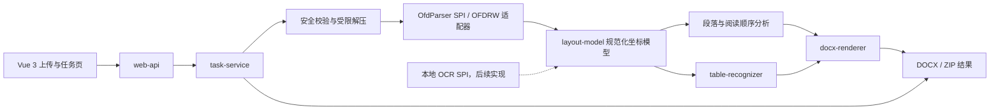

# FormatConverter 技术设计（第一阶段）

> 本文保留最初单页 MVP 的设计基线。项目已在 2026-08-04 升级为完整多页转换，当前实现边界见 `multi-page-upgrade.md` 和 `known-limitations.md`。

> 状态：设计评审中，尚未开始业务代码实现  
> 基线日期：2026-08-04  
> 工作区现状：Git 仓库已初始化，但无提交、无源码和构建文件。

## 1. 结论与可行性

该系统在限定范围内技术可行。推荐采用“结构化解析 OFD → 统一版面模型 → 语义重建段落/表格 → 生成 OOXML DOCX”的主链路，不经 PDF，不把整页栅格化。

可行性分级：

| 场景 | 判断 | 说明 |
|---|---|---|
| 文字型 OFD 的真实文字 | 高 | OFD 文字对象含文字、坐标、字号、字体引用、颜色和变换信息；可重建为 Word 文本 Run。 |
| 规则、有边框、矢量线表格 | 高 | 可根据 Path 线段和文字坐标建立网格；在定义清晰的验收样本集上达到 95% 结构准确率有现实可能。 |
| 合并单元格、多行单元格 | 中高 | 可从缺失内部边界、完整外边界及文字归属推断，但断线、重叠线和不规则表格需要置信度与警告。 |
| 普通正文的版面接近原稿 | 中高 | 可恢复页面尺寸、段落、缩进、对齐和行距；OFD 是固定版式，Word 是流式排版，不能承诺逐像素一致。 |
| 复杂多栏、文字环绕、叠印 | 中 | 需要阅读顺序和区域分析；必要时可使用“可编辑文本框”，但默认仍输出真实段落。 |
| 图片、背景、普通印章 | 中高 | 独立图片可作为浮动图片；复杂矢量装饰可只渲染该装饰层，不得包含正文和表格。 |
| 数字签章外观 | 中 | 签章可能在签名容器或厂商扩展中，需解析库或商业 SDK 支持；失败必须输出明确警告。 |
| 扫描型 OFD | MVP 不支持 | 只检测并返回 `OCR_REQUIRED` 警告，保留本地 OCR SPI；不得调用外部云服务。 |
| 加密 OFD、私有扩展、损坏文件 | 不保证 | 明确失败或降级，不能伪造成功。 |

“95% 表格准确率”应定义为：在双方确认的代表性文字型 OFD 验收集上，按单元格拓扑（行列数、rowSpan、colSpan、文字归属）统计；不能解释为对任意厂商、任意无线/异形表格的无条件保证。

## 2. 总体架构



关键边界：

1. `layout-model` 不引用 OFDRW、Spring、POI/docx4j。
2. OFD 库只存在于 `ofd-parser-ofdrw` 适配器内，后续可替换为商业 SDK。
3. 表格识别只读取规范化后的线、文字、背景，不操作 OFDRW 对象。
4. DOCX 渲染只读取段落、表格、图片和页面模型，不理解 OFD XML。
5. 安全解压由本系统实现；通过校验后，解析适配器只读取隔离目录。
6. 转换结果可以带警告而成功；数据丢失风险较高时必须失败或标记降级，不能静默忽略。

## 3. 推荐目录结构

```text
FormatConverter/
├── pom.xml                         # Maven 聚合与版本锁定
├── README.md
├── LICENSE
├── .gitignore
├── layout-model/                   # 纯 Java 中间模型、单位/矩阵/告警
├── ofd-parser/
│   ├── ofd-parser-api/             # OfdParser、ParsedDocument、能力声明
│   └── ofd-parser-ofdrw/           # OFDRW 实现，不向外泄露 OFDRW 类型
├── layout-analyzer/                # 文字行、段落、阅读顺序、页眉页脚分析
├── table-recognizer/               # 有线表格识别及无线表格 SPI
├── docx-renderer/                  # DOCX 渲染接口与 POI 实现
├── ocr-spi/                        # 本地 OCR 扩展接口，MVP 无具体引擎
├── task-service/                   # 状态机、队列、存储、清理、转换编排
├── web-api/                        # Spring Boot 启动模块、REST、统一异常
├── frontend/                       # Vue 3 + Vite；产物构建时复制进 JAR
├── acceptance-tests/               # 端到端、DOCX 重开、样本期望 JSON
├── test-fixtures/                  # 仅合成/脱敏 OFD，不放敏感真实文件
├── deploy/
│   ├── application.yml.example
│   ├── start.sh
│   ├── stop.sh
│   ├── status.sh
│   └── Dockerfile
└── docs/
    ├── technical-design-phase-1.md
    ├── api.md
    ├── build-and-deploy.md
    ├── acceptance.md
    └── known-limitations.md
```

依赖方向：

```text
layout-model
  ↑          ↑              ↑
parser     analyzer     table-recognizer
  └──────────┴──────────────┘
                 ↓
           docx-renderer
                 ↓
           task-service
                 ↓
             web-api
```

`web-api` 是唯一可执行 Spring Boot 模块。最终普通部署只需 JRE 17、一个 JAR、配置文件和脚本；Docker 只是附加交付方式。

## 4. OFD 解析组件选型

### 4.1 推荐：OFDRW 作为首个适配器

推荐基线为 `org.ofdrw` 的 `ofdrw-reader` + `ofdrw-core`，在 PoC 样本验证通过后锁定具体版本；截至本设计日期，上游 README 给出的版本是 2.3.9。

选择理由：

- Apache-2.0，允许在遵守许可证的前提下内网商业使用。
- Java 实现，官方说明支持 JDK 8+；使用解析核心时不依赖 Word、COM 或 Windows DLL。
- `OFDReader` 可取得页面数、页面对象、页面区域、模板页、签名和资源管理器。
- 核心模型直接暴露 `TextObject`、`PathObject`、`ImageObject`；文字对象包含字体引用、字号、方向、粗细、斜体、填充/描边颜色和 TextCode，Path 包含描边/填充与路径数据，资源管理器可取得字体和多媒体。
- 纯 Java 解析链路适合国产 Linux 的 x86_64/ARM64；仍需分别在目标发行版和 JDK 上做真实样本验证。

必须规避的风险：

- 不直接使用它的默认解压入口处理不可信上传。当前 `ZipUtil.setMaxSize` 已弃用且为空操作，默认解压过程没有满足本项目要求的总解压量、条目数、单条目大小和压缩比限制。
- API 是 OFD XML 对象模型，不会自动给出 Word 段落和表格；这些属于本项目算法职责。
- 模板页、裁剪区、层变换、对象 CTM、字形替换和签章必须由适配器显式展开；不能只调用纯文本抽取示例。
- 升级版本前必须跑固定样本回归，不使用 Maven 浮动版本。

官方依据：[OFDRW 项目与许可证](https://github.com/ofdrw/ofdrw)、[OFDReader 源码](https://github.com/ofdrw/ofdrw/blob/master/ofdrw-reader/src/main/java/org/ofdrw/reader/OFDReader.java)、[TextObject](https://github.com/ofdrw/ofdrw/blob/master/ofdrw-core/src/main/java/org/ofdrw/core/basicStructure/pageObj/layer/block/TextObject.java)、[PathObject](https://github.com/ofdrw/ofdrw/blob/master/ofdrw-core/src/main/java/org/ofdrw/core/basicStructure/pageObj/layer/block/PathObject.java)、[ImageObject](https://github.com/ofdrw/ofdrw/blob/master/ofdrw-core/src/main/java/org/ofdrw/core/basicStructure/pageObj/layer/block/ImageObject.java)。

### 4.2 备选比较

| 方案 | 结构化解析能力 | 内网/跨平台 | 许可证与依赖 | 结论 |
|---|---|---|---|---|
| OFDRW | 页、文字、Path、图片、字体/多媒体、模板和签名对象可访问 | 纯 Java 路线，适合 x86_64/ARM64 验证 | Apache-2.0 | MVP 首选，必须加适配层和自有安全解压。 |
| 福昕 OFD SDK | 官方文档列出页面、文本、图形对象、图层、签章和资源等较完整能力 | 本地 SDK；当前中文 OFD 能力页列出的预编译 OFD 环境为 Windows/Linux x86_64，另有文档提到 Linux armv8，信息不一致 | 商业授权、原生引擎文件 | 可做企业备选；采购前必须让厂商书面确认 Java + 麒麟/统信 + ARM64 + 所需 OFD 图元 API，不作为 MVP 默认依赖。 |
| ofd.js / LiteOfd | 更偏浏览器预览和渲染 | JS，可本地运行 | 开源但后端 Java 集成和结构稳定性不如 OFDRW | 可用于调试预览，不作为服务端权威解析器。 |
| 自研 ZIP/XML 解析器 | 完全可控 | 可纯 Java、全架构 | 研发与标准兼容成本最高 | 只补 OFDRW 缺口，不建议第一阶段完整重写标准。 |
| OFD→PDF→Word | 会丢失 OFD 原生结构且表格仍需二次推断 | 可实现 | 违背项目主路线 | 明确排除，只可作为人工诊断对照，不能进入生产转换链路。 |

福昕能力和平台信息参考其[OFD 功能概述](https://devdocs.fuxinsoft.cn/development-guide/pdf-sdk-desktop-server/features/ofd/overview.html)。

### 4.3 OfdParser SPI

```java
public interface OfdParser {
    ParserCapabilities capabilities();
    OfdProbeResult probe(SafeOfdPackage source) throws OfdParseException;
    ParsedDocument open(SafeOfdPackage source, ParseLimits limits)
            throws OfdParseException;
}

public interface ParsedDocument extends AutoCloseable {
    DocumentMetadata metadata();
    int pageCount();
    PageModel parsePage(int oneBasedPageNumber, CancellationToken token);
    List<ConversionWarning> warnings();
}
```

`SafeOfdPackage` 只能由安全校验模块创建，表示已经完成路径、大小、条目数、压缩比和 OFD 根结构检查的只读目录。适配器禁止接受任意外部解压路径。

## 5. DOCX 组件建议

MVP 推荐 Apache POI XWPF，外加少量封装良好的底层 WordprocessingML 操作：

- 优点：Apache-2.0、纯 Java、团队常见、DOCX 生成和重开校验方便。
- 表格固定宽度、`tblGrid`、`gridSpan`、`vMerge`、行高、单元格底色/边框以及 `wp:anchor` 浮动图片，部分需要使用 XMLBeans 底层对象。
- 所有底层 OOXML 操作集中在 `docx-renderer/ooxml` 包，不向业务层泄露。

POI 官方也明确说明 XWPF 核心 API 并不覆盖所有 OOXML 能力，必要时需使用底层 XMLBeans，因此第一阶段应先用 Word 和 WPS 双开验证关键 OOXML 片段。参考：[Apache POI XWPF 指南](https://poi.apache.org/components/document/quick-guide-xwpf.html)与[XWPF API](https://poi.apache.org/apidocs/dev/org/apache/poi/xwpf/usermodel/package-summary.html)。

保留 `DocxRenderer` 接口；若 PoC 证明大量操作都落到底层 XML，可在不影响上游模型的前提下切换 docx4j。

## 6. 中间模型设计

### 6.1 坐标与通用约束

- 模型统一使用毫米，原点为页面左上角，X 向右、Y 向下。
- 解析阶段展开模板页、层变换和对象 CTM；模型中的 `box` 是页面最终坐标。
- 同时保存原始对象 ID、原始矩阵、层、Z 序和来源路径，便于诊断。
- 浮点计算使用 `double`，比较必须经过 `GeometryTolerance`；序列化验收数据时按固定精度输出。
- 到 DOCX 边界才换算：`twip = mm × 1440 / 25.4`，`EMU = mm × 36000`。
- 所有推断对象带 `confidence`、`evidence` 和 `warnings`。

### 6.2 核心对象

```text
DocumentModel
├── metadata / sourceFingerprint / parserInfo
├── fonts: Map<ResourceId, FontResource>
├── images: Map<ResourceId, BinaryResource>
├── pages: List<PageModel>
└── warnings

PageModel
├── pageNumber / pageId
├── physicalBox / contentBox / bleedBox / rotation
├── sourceElements: List<PageElement>      # 按 Z 序
├── paragraphs: List<ParagraphModel>       # 分析产物
├── tables: List<TableModel>               # 识别产物
├── decorations / header / footer / stamps
└── warnings

PageElement (sealed)
├── TextBlock
├── ImageBlock
└── LineElement / PathDecoration
```

建议字段：

- `TextBlock`：页码、边界框、基线、读写方向、旋转、字体 ID/名称、字号、粗体、斜体、颜色、透明度、字符间距、字形/字符位置、TextCode 顺序、Z 序。
- `ImageBlock`：边界框、资源 ID、MIME、裁剪、透明度、变换、角色（普通图片/背景/印章/签章外观）、二值蒙版、Z 序。
- `LineElement`：起止点、水平/垂直属性、线宽、颜色、线型、透明度、来源 Path ID、是否闭合图形的边、几何置信度。
- `ParagraphModel`：边界框、行列表、Run 列表、对齐、首行/左右缩进、段前段后、精确/最小行距、阅读顺序、是否允许文本框降级。
- `TableModel`：边界框、X/Y 网格、列宽、行高、行、单元格、合并区域、表级样式、是否跨页、置信度、识别警告。
- `RowModel`：行索引、高度、固定/最小高度、是否表头、是否允许跨页拆行。
- `CellModel`：起始行列、rowSpan、colSpan、边界框、段落列表、四边样式、底色、内边距、水平/垂直对齐、文字归属证据。
- `MergeCellModel`：锚点行列、rowSpan、colSpan、缺失内部边证据、完整外边证据、置信度。

模型不存服务器临时绝对路径；二进制资源通过任务内的受控 `ResourceHandle` 引用，避免路径泄漏和跨任务访问。

## 7. 文字、段落与阅读顺序

1. 展开每个 TextObject 的 TextCode、DeltaX/DeltaY、字形替换和 CTM，得到字符/字形级位置。
2. 按基线方向、字号和 Y 距离聚类成文字行；旋转文字单独成组。
3. 按水平间距、行距、字体变化、缩进和区域连通性把行聚合为段落。
4. 先识别表格区域，落在单元格内的文字从正文候选中排除，避免重复输出。
5. 页面分栏使用 X 区间投影和重叠关系建立阅读顺序图；不能可靠排序时输出 `AMBIGUOUS_READING_ORDER`。
6. 重复出现在多页顶部/底部且位置、样式一致的元素，后续阶段可识别为页眉页脚；MVP 先按普通元素保留并给出提示。

DOCX 默认使用流式段落。只有孤立标签、盖章旁注或无法用缩进/制表位表达的固定区域，才允许使用可编辑 Word 文本框；禁止把正文文字栅格化。

## 8. 有线表格识别算法

### 8.1 Path 归一化

1. 展开 PageBlock、模板和层，应用所有矩阵和裁剪。
2. 解析 Path 指令；直线段直接保留，矩形拆成四条边，曲线只在近似为水平/垂直直线且误差合格时参与网格。
3. 只把接近水平或垂直的线作为表格候选；其他 Path 留作装饰。
4. 记录线宽、颜色、线型和 Z 序。背景填充矩形作为潜在单元格底色，不直接当边框。

### 8.2 合并线段与建立网格

容差不写死，按页面尺度和中位线宽自适应，初始建议：

- 角度误差：`≤ 1°`；
- 同轴聚类：`max(0.20 mm, 1.5 × medianStrokeWidth)`；
- 可修复小断口：`≤ max(0.50 mm, 2 × medianStrokeWidth)`；
- 边覆盖率：默认 `≥ 0.85`。

步骤：

1. 按方向和轴坐标聚类，吸附相近坐标。
2. 合并同轴重叠线和小间隙线，但保存“原始覆盖率”和“修复长度”。
3. 建立线段相交图，按连通区域生成表格候选，排除孤立分隔线和装饰框。
4. 对交点及端点进行 X/Y 聚类，得到有序坐标网格 `X[0..n]`、`Y[0..m]`。
5. 为每个原子网格边建立 `EdgeEvidence`：真实覆盖、修复覆盖、线型、颜色、来源 Path。

### 8.3 单元格和合并单元格

1. 每个相邻 X/Y 区间构成一个原子格。
2. 外边完整、内部边存在时保持独立单元格。
3. 相邻原子格之间缺少内部边时建立连通关系。
4. 连通分量的并集必须是矩形，并且外周边覆盖达到阈值，才确认为合并单元格。
5. 横向缺边形成 `colSpan`，纵向缺边形成 `rowSpan`；两者可组合。
6. 非矩形连通分量、外边严重缺失、双线冲突或多个解释得分接近时，不强行合并，输出 `AMBIGUOUS_MERGE`。

### 8.4 文字分配和样式推断

- 以字符/字形中心点和包围盒交叠率分配，而不是仅以整个 TextObject 中心点分配。
- 跨边界文字选择交叠率最大单元格；低于阈值或两个候选接近时发出 `TEXT_CROSSES_CELL_BORDER`。
- 单元格内先按基线 Y，再按 X/阅读方向排序；基线差形成真实换行，同一行的间距转换为普通空格或制表逻辑。
- 水平对齐由左右空白、文字行宽和多行一致性推断；垂直对齐由上下空白推断。
- 边框样式来自对应边的证据；底色取位于边框后方且覆盖单元格的填充 Path。

### 8.5 置信度与降级

建议总分：

```text
0.35 × 边拓扑完整度
+ 0.20 × 坐标聚类稳定度
+ 0.20 × 文字归属清晰度
+ 0.15 × 合并区域矩形度
+ 0.10 × 样式一致性
```

- `≥ 0.85`：正常输出真实 Word 表格。
- `0.65–0.85`：输出真实表格，同时返回具体警告和页码/区域。
- `< 0.65`：MVP 不伪造表格；输出可编辑段落和可保留的独立线条，并返回 `TABLE_RECOGNITION_UNRELIABLE`。后续可提供“强制表格”配置，但默认关闭。

无线表格使用独立策略接口：

```java
public interface BorderlessTableRecognizer {
    List<TableCandidate> recognize(PageModel page, RecognitionContext context);
}
```

MVP 只注册有线表格策略，避免无线表格误识别普通多栏正文。

## 9. DOCX 渲染策略

1. 每种 OFD 页面尺寸/方向对应 Word 节；设置 `w:pgSz`，页边距从内容区与物理页差计算并设安全下限。
2. 正文按阅读顺序生成真实段落和 Run，映射字体、字号、颜色、粗斜体、对齐、缩进和行距。
3. 表格设置固定布局、`tblGrid`、精确列宽；行高按内容风险选择“至少”或“精确”，避免裁字。
4. 横向合并使用 `gridSpan`，纵向合并使用 `vMerge restart/continue`，并用 POI 重开后检查 OOXML 拓扑。
5. 表格默认禁止自动调整列宽；长文本优先保持单元格内换行，不通过缩小为不可读字号来硬塞。
6. 图片、印章放置为 `wp:anchor` 浮动图片，保留相对页面坐标和层级。复杂 Path 可只渲染装饰对象为透明 PNG；渲染输入列表必须明确排除 TextObject 和表格边线。
7. 同网格、同样式、前页近底部且后页近顶部的表格可在后续阶段识别为跨页表格；Word 中合并为一张表、设置重复表头和禁止关键行拆分。MVP 仅处理单页。
8. 绝不创建“整页背景截图 + 隐藏文字”的伪编辑方案。

字体采用配置式映射：OFD 字体名 → 内网已安装字体 → 替代字体。结果警告中列出缺失字体，但日志不记录正文。字体文件是否允许嵌入 DOCX 需同时检查 OFD 资源许可和字体嵌入权限；默认不嵌入未知授权字体。

## 10. 任务、存储与安全设计

任务状态机：

```text
WAITING → VALIDATING → PARSING → RECOGNIZING → RENDERING → SUCCESS
    └──────────────── 任意阶段 ─────────────────────────→ FAILED
    └──────────────── 超时/取消 ─────────────────────────→ CANCELLED
```

内部细分状态通过 API 归一为用户要求的四种状态：`WAITING → 等待`，`VALIDATING/PARSING/RECOGNIZING/RENDERING → 转换中`，`SUCCESS → 成功`，`FAILED/CANCELLED → 失败`；响应中另带 `stage` 供进度展示。

每任务隔离目录：

```text
data/tasks/{unguessable-task-id}/
├── manifest.json        # 原子替换写入，不含正文
├── input/input-0001.ofd # 服务端重命名
├── work/file-0001/      # 安全解压目录
└── output/*.docx|*.zip
```

安全基线从 MVP 首日实现，不能推迟：

- 扩展名、允许 MIME、ZIP 魔数和 OFD 根文件/文档引用四层校验；MIME 只作辅助，不能单独信任。
- 解压前拒绝绝对路径、`..`、NUL、符号链接/硬链接及规范化后越界路径。
- 同时限制上传字节数、ZIP 条目数、单条目解压量、总解压量、压缩比、XML 深度/节点数、页数和资源图片尺寸。
- XML 禁用 DTD、外部实体、XInclude 和外部网络访问；只允许读取任务目录内资源。
- 解析与转换线程池有界，队列满返回统一的 `TASK_QUEUE_FULL`，不无限堆积。
- 阶段间检查截止时间和中断标记。若真实样本证明第三方库不能响应中断，生产版改为隔离 Worker JVM，以便硬超时终止；不能宣称仅靠 `Future.cancel` 实现硬超时。
- 日志只记录 taskId、文件序号、字节数、页数、阶段、耗时、错误码和堆栈摘要，不记录原文件名、正文、身份证号等内容。
- `manifest.json` 持久化状态。服务启动时把遗留 `VALIDATING/PARSING/RECOGNIZING/RENDERING` 标记为 `FAILED:SERVICE_RESTARTED`，因此不会误报仍在转换；输入仍完整的 `WAITING` 任务重新入队，否则标记失败。后续再设计阶段级安全续跑。
- 清理由任务 TTL、失败 TTL 和定时扫描共同执行；下载时采用租约，避免边下载边删除。

## 11. 第一阶段可运行 MVP 计划

### 范围

只完成一个可验证闭环：

```text
单个文字型 OFD 上传
→ 安全校验与隔离解压
→ 明确解析第 1 页
→ 提取真实文字、直线/矩形 Path 和普通图片
→ 识别一个或多个规则有线表格（含横向/纵向合并、多行单元格）
→ 生成单页 DOCX
→ 查询进度并下载
```

多页输入在 MVP 中不得静默截断：任务成功时必须返回 `MVP_FIRST_PAGE_ONLY` 警告，DOCX 元数据中也记录转换范围。扫描页返回 `OCR_REQUIRED`，不生成伪造正文。

### 实施顺序

1. **工程骨架与模型**：创建 Maven 聚合工程、Java 17 编译约束、依赖锁定、JaCoCo/SpotBugs 基础配置；实现不可变模型、单位和矩阵运算。
2. **安全入口**：实现上传落盘、文件探测、受限 ZIP 解压和最小 OFD 结构验证；先写 Zip Slip、压缩炸弹、损坏 ZIP 测试。
3. **OFDRW 适配器**：解析第 1 页，展开模板/层/CTM，输出文字、Path 线和图片资源；记录不支持对象警告。
4. **布局与表格**：实现线段合并、网格、单元格、合并区域、文字分配和置信度；用纯模型 fixture 做单元测试，不依赖真实 OFD 才能测算法。
5. **DOCX**：用 POI 生成页面、段落、真实表格、合并单元格和浮动图片；随后用 POI 重新打开并断言文字/表格拓扑。
6. **任务/API**：有界异步执行，实现 `POST /api/tasks`、`GET /api/tasks/{id}`、`GET /api/tasks/{id}/download`、`DELETE` 和 `/api/health`；统一错误体。
7. **最小前端**：拖放单文件、上传进度、轮询、警告展示和下载；先兼容 Chromium 内核国产浏览器，不使用高风险新 Web API。
8. **端到端验证**：合成样本 + 经批准的脱敏真实样本；Word/WPS 人工打开检查，Linux x86_64/ARM64 各运行一次 JAR 冒烟测试。

### MVP 必须通过的测试

- `layout-model`：单位换算、矩阵组合、边界框、Z 序稳定性。
- `table-recognizer`：线段吸附、小断口、独立单元格、横并、纵并、行列同时合并、多行文字、低置信度警告。
- `ofd-parser-ofdrw`：页面尺寸、文字样式、CTM、模板元素、Path、图片资源、损坏引用。
- 安全：Zip Slip、绝对路径、过多条目、单条目/总量超限、高压缩比、XXE、超页数、伪扩展名。
- DOCX：可重开、正文可提取、表格行列和 `gridSpan/vMerge` 正确、无整页图片关系。
- API：状态迁移、单文件失败不影响服务、删除幂等、下载前后状态一致。

### MVP 完成定义

1. `mvn clean verify` 全部通过，并生成测试与覆盖率报告。
2. 浏览器可上传一个脱敏文字型 OFD，查看进度，下载 DOCX。
3. DOCX 在 Microsoft Word 和 WPS 中均可打开；文字可编辑，表格单元格可编辑，合并拓扑正确。
4. DOCX 包中不存在整页 OFD 截图；图片关系仅对应原始独立图片/印章/装饰。
5. 解析限制和所有降级均在任务警告中可见。
6. 在 Java 17 下以普通 JAR 运行，不需要 Word、COM、Windows DLL 或外部网络。

### MVP 暂不包含

- 全文多页、跨页表格合并、批量上传/ZIP 下载；
- OCR 具体引擎；
- 无线表格、嵌套/异形表格；
- 所有签章厂商格式、加密 OFD；
- 自动字体嵌入；
- 生产级 Worker JVM 硬隔离。

这些能力进入第二阶段，但接口和模型在 MVP 中预留。

## 12. 主要风险与决策点

| 风险 | 影响 | 应对 |
|---|---|---|
| 固定版式转流式版式存在天然差异 | Word 中换行、分页与原稿不完全一致 | 页面分节、固定表格网格、字体映射；对复杂区域允许可编辑文本框并给警告。 |
| OFD 字体为子集或缺字形 | 乱码、宽度变化 | 解析字形映射；配置国产字体替代；缺失时显式警告和样本回归。 |
| Path 不等于语义表格 | 假表格、错误合并 | 连通域 + 网格拓扑 + 文字证据 + 置信度，不可靠时不强行生成。 |
| 签章数据不一定是普通图片 | 印章丢失 | 独立 `SealAppearanceExtractor`；OFDRW 不足时评估商业 SDK。 |
| 同页含多个坐标系/裁剪 | 元素错位 | 适配器层统一矩阵并保留原始证据，增加矩阵金丝雀测试。 |
| POI 高级 OOXML API 不完整 | WPS/Word 显示差异 | 高级操作集中封装，生成后重开验证，再进行 Word/WPS 金样人工验证。 |
| 同 JVM 超时不能硬终止 | 线程占用、服务不稳定 | MVP 阶段限制输入并协作取消；生产阶段隔离 Worker JVM。 |
| 商业 SDK ARM64 支持信息不一致 | 国产 ARM 部署阻塞 | 默认坚持纯 Java OFDRW；商业备选必须 PoC 和厂商书面确认。 |

## 13. 设计确认后第一批产物

设计确认后只进入 MVP，不直接铺开全部功能。第一批提交预计包含：

- Maven 模块骨架和版本管理；
- 上述中间模型与单元测试；
- `OfdParser` / `DocxRenderer` / `BorderlessTableRecognizer` / `OcrEngine` SPI；
- 安全解压器及恶意 ZIP 测试；
- 一页 OFDRW 解析适配器；
- 有线表格算法及合并单元格测试；
- 单页 DOCX 生成与最小 REST/前端闭环；
- 构建说明、MVP 接口说明、测试报告和已知限制。

开始编码前需要确认的架构决策只有两项：

1. 接受“OFDRW 为默认解析器，商业 SDK 仅保留适配器位”的选型。
2. 接受“第一阶段严格单文件、单页；多页明确警告，不静默截断”的 MVP 边界。
